# PandaDoc Automation - Complete Agentic Workflow

```mermaid
graph TB
    subgraph "MAIN WORKFLOW - Document Upload & Send"
        START1[User Uploads PDF] --> A1[Agent 1: PDF Extractor]
        A1 -->|Extract Signer Info| A2[Agent 2: Data Validator]
        A2 -->|Validate Data| A3[Agent 3: Form Field Creator]
        A3 -->|Add Blank Page + Signature Fields| A4[Agent 4: Document Uploader]
        A4 -->|Upload to PandaDoc API| A5[Agent 5: Field Assigner]
        A5 -->|Map Fields to Recipients| A6[Agent 6: Document Sender]
        A6 -->|Send for Signatures| TRACK[📊 Add to Tracker]
        TRACK --> END1[Document Sent ✅]
    end

    subgraph "TRACKING SYSTEM"
        TRACK --> JSON[(pandadoc_tracking.json)]
        JSON -->|Stores| DOCINFO[Document ID<br/>Recipients<br/>Sent Date<br/>Status<br/>Follow-up Count]
    end

    subgraph "SCHEDULER"
        CRON[Daily Scheduler<br/>09:00 AM] -->|Triggers| START2
    end

    subgraph "FOLLOW-UP WORKFLOW - Automated Reminders"
        START2[Follow-up Job Starts] --> B1[Agent 1: Tracker Loader]
        B1 -->|Load Pending Docs| B2[Agent 2: Status Checker]
        B2 -->|Query PandaDoc API| B3[Agent 3: Filter]
        B3 -->|24+ hrs since last follow-up?| DECISION{Status?}

        DECISION -->|Completed| COMPLETE[Mark Completed ✅]
        DECISION -->|All Signed| COMPLETE
        DECISION -->|Still Pending| B4[Agent 4: Email Drafter]

        B4 -->|AI Draft with Gemini| B5[Agent 5: Email Sender]
        B5 -->|Send via Gmail SMTP| B6[Agent 6: Tracker Updater]
        B6 -->|Update Follow-up Date & Count| END2[Follow-up Complete ✅]

        COMPLETE --> END2
    end

    JSON -.->|Read Pending| B1
    B6 -.->|Write Updates| JSON

    style START1 fill:#e1f5e1
    style END1 fill:#e1f5e1
    style START2 fill:#fff4e1
    style END2 fill:#fff4e1
    style TRACK fill:#ffd6d6
    style JSON fill:#d6e4ff
    style CRON fill:#ffe4d6
    style DECISION fill:#f0e6ff
```

---

## Workflow Details

### Main Workflow (workflow.py)
**Trigger:** User uploads PDF via Streamlit UI
**Agents:** 6 agents in sequence
**Output:** Document sent to recipients + tracked in JSON

| Agent | Function | Technology |
|-------|----------|------------|
| 1. PDF Extractor | Extract signer info from PDF tables | PyMuPDF, Gemini AI |
| 2. Data Validator | Validate emails, names, roles | Gemini AI |
| 3. Form Field Creator | Add blank page + centered signature fields | PyMuPDF |
| 4. Document Uploader | Upload PDF to PandaDoc | PandaDoc API |
| 5. Field Assigner | Map signature fields to recipients | PandaDoc API |
| 6. Document Sender | Send document for signatures | PandaDoc API |

---

### Follow-up Workflow (followup_workflow.py)
**Trigger:** Daily scheduler at 09:00 AM
**Agents:** 6 agents in sequence
**Output:** Follow-up emails sent to pending signers

| Agent | Function | Technology |
|-------|----------|------------|
| 1. Tracker Loader | Load pending documents from JSON | File I/O |
| 2. Status Checker | Check current document status | PandaDoc API |
| 3. Filter | Filter docs needing follow-up (24+ hrs) | Date calculation |
| 4. Email Drafter | Draft personalized follow-up emails | Gemini AI |
| 5. Email Sender | Send emails via Gmail SMTP | SMTP |
| 6. Tracker Updater | Update follow-up dates and counts | File I/O |

---

## Data Flow

---

## Technology Stack

